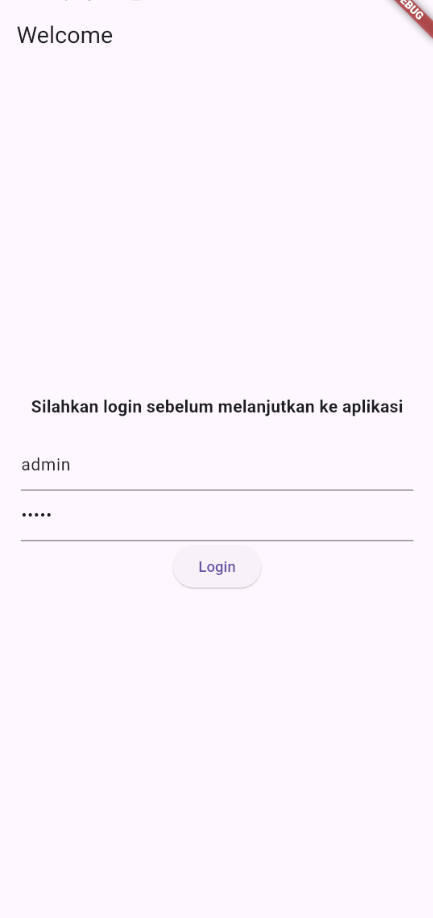
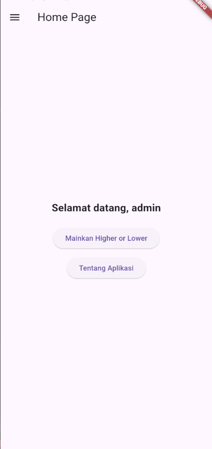
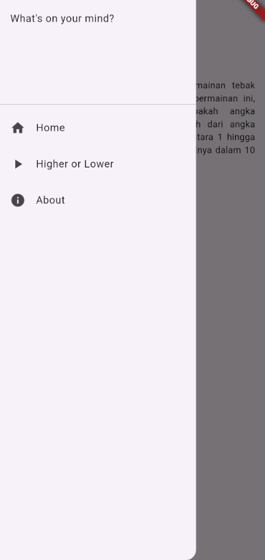
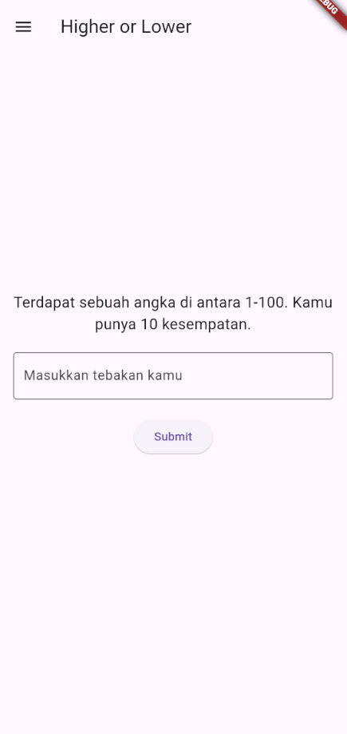
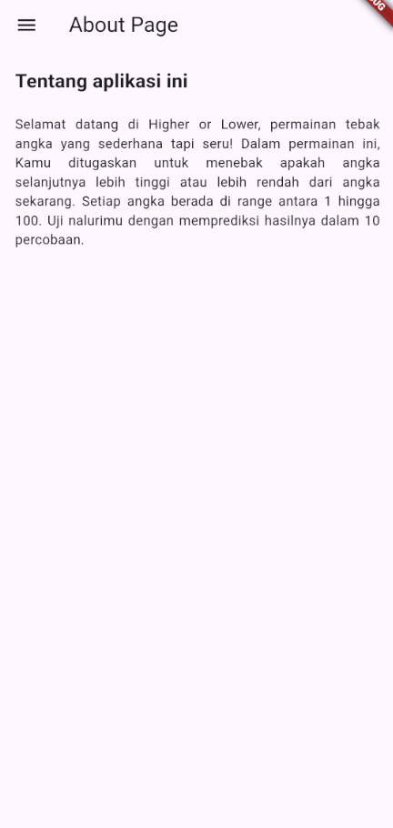

# TUGAS PERTEMUAN 3 - PRAKTIKUM PEMROGRAMAN MOBILE

Nama: Reyno Alfarez Marchelian

NIM: H1D022111

Shift Lama: E

Shift Baru: B

## PENJELASAN



```
class _LoginPageState extends State<LoginPage> {
  final TextEditingController _usernameController = TextEditingController();
  final TextEditingController _passwordController = TextEditingController();
  var namaUser;
```

Digunakan untuk mengontrol input username dan password dari pengguna.

```
void _saveUsername() async {
  SharedPreferences prefs = await SharedPreferences.getInstance();
  prefs.setString('username', _usernameController.text);
}
```

Fungsi ini digunakan untuk menyimpan username yang dimasukkan oleh pengguna ke dalam penyimpanan lokal menggunakan SharedPreferences.

```
_showInput(namaController, placeholder, isPassword) {
  return TextField(
    controller: namaController,
    obscureText: isPassword,
    decoration: InputDecoration(
      hintText: placeholder,
    ),
  );
}
```

Fungsi ini membuat widget TextField untuk kolom input pengguna.

---



```
class _HomePageState extends State<HomePage> {
  var namaUser;

  void _loadUsername() async {
    SharedPreferences prefs = await SharedPreferences.getInstance();
    namaUser = prefs.getString('username');
    setState(() {});
  }
```

Variabel namaUser untuk menyimpan nama pengguna yang dimuat dari penyimpanan lokal.
_loadUsername untuk memuat username yang diinput user dari penyimpanan lokal menggunakan SharedPreferences.

```
const SizedBox(height: 20),
            ElevatedButton(
              onPressed: () {
                Navigator.push(
                  context,
                  MaterialPageRoute(
                    builder: (context) => HigherLowerPage(),
                  ),
                );
              },
              child: const Text('Mainkan Higher or Lower'),
            ),
            const SizedBox(height: 10),
            ElevatedButton(
              onPressed: () {
                Navigator.push(
                  context,
                  MaterialPageRoute(
                    builder: (context) => const AboutPage(),
                  ),
                );
              },
              child: const Text('Tentang Aplikasi'),
            ),
```

Digunakan untuk membuat tombol yang muncul di halaman Home, untuk membawa user ke halaman 'Higher or Lower' atau halaman 'About'

---



```
ListTile(
            leading: const Icon(Icons.home),
            title: const Text('Home'),
            onTap: () {
              // Navigasi halaman Home
              Navigator.push(
                context,
                MaterialPageRoute(
                  builder: (context) => const HomePage(),
                ),
              );
            },
          ),
          ListTile(
            leading: const Icon(Icons.play_arrow),
            title: const Text('Higher or Lower'),
            onTap: () {
              // Navigasi halaman Higher or Lower
              Navigator.push(
                context,
                MaterialPageRoute(
                  builder: (context) => const HigherLowerGame(),
                ),
              );
            },
          ),
          ListTile(
            leading: const Icon(Icons.info),
            title: const Text('About'),
            onTap: () {
              // Navigasi halaman About
              Navigator.push(
                context,
                MaterialPageRoute(
                  builder: (context) => const AboutPage(),
                ),
              );
            },
          )
```

Digunakan untuk menampilkan menu-menu di side menu.

---



ini adalah permainan Higher or Lower seperti yang saya buat di tugas pertemuan 1, namun dibuat dengan Flutter. Di game simple ini, user akan diberikan kesempatan 10 kali untuk menebak angka random dari 1 sampai 100 hanya dengan clue yang memberi tahu kalau input mereka lebih besar atau lebih kecil daripada jawaban yang di-generate program.

```
int jawaban = Random().nextInt(100) + 1;
int attempt = 0;
int kesempatan = 10;
String hint = '';
TextEditingController tebakanController = TextEditingController();
```

jawaban: Angka yang harus ditebak oleh pemain, dihasilkan secara acak antara 1 dan 100.
attempt: Jumlah percobaan yang sudah dilakukan oleh pemain.
kesempatan: Batas jumlah percobaan yang tersedia untuk pemain (10 kali).
hint: Inisialisasi petunjuk yang akan ditampilkan kepada pemain berdasarkan tebakan mereka.
tebakanController: Mengontrol input dari pemain yang digunakan untuk menebak angka.

```
void checkTebakan(String input) {
  var tebakan = int.tryParse(input);

  if (tebakan == null || tebakan < 1 || tebakan > 100) {
    setState(() {
      hint = 'Tebakan harus di antara 1-100!';
    });
    return;
  }

  setState(() {
    attempt++;
    kesempatan--;

    if (tebakan < jawaban) {
      hint = 'Terlalu kecil!';
    } else if (tebakan > jawaban) {
      hint = 'Terlalu besar!';
    } else {
      hint = 'Selamat, jawaban kamu benar! Setelah $attempt kali tebakan.';
      _showResultDialog('Selamat!',
          'Jawaban kamu benar setelah $attempt kali tebakan.\nJawabannya: $jawaban');
    }

    if (kesempatan == 0 && tebakan != jawaban) {
      hint = 'Kesempatan habis! Jawabannya adalah $jawaban.';
      _showResultDialog('Kesempatan habis!', 'Jawabannya adalah $jawaban.');
    }
  });
}
```
Fungsi ini mengecek apakah tebakan pemain benar.
- Jika tebakan lebih kecil dari angka sebenarnya, pesan "Terlalu kecil" muncul.
- Jika tebakan lebih besar, pesan "Terlalu besar" muncul.
- Jika tebakan benar, pemain akan diberi pesan selamat, dan dialog hasil akan ditampilkan.
- Jika kesempatan habis, pemain akan diberi tahu jawaban sebenarnya.

---



Tampilan halaman About
